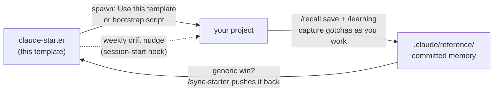

# claude-starter

[](https://github.com/ryanportfoilio/claude-starter/actions/workflows/validate-template.yml)
[](LICENSE)
[](#the-skill-set)

A Claude Code project template that stays in sync with the projects it spawns.

Most people configure Claude Code once, per repo, and that setup dies there. This template turns the config into a fleet: every new project starts from a tuned rule kernel, a curated skill set, a self-populating memory library, and session hooks. Improvements made in any project flow back to the template, and template updates flow out to every project.



Distilled from a production repo, with the project-specific content stripped out.

## Why this exists

Claude Code works better with standing instructions, reusable skills, and accumulated project knowledge. But that value normally lives in a single repo and never propagates. claude-starter fixes the propagation problem in three ways:

- **Spawn configured.** New projects start with the kernel rules, skill set, and memory system already in place. `/init-project` tailors them to the actual stack in one short Q&A.
- **Self-improving.** `/recall` and `/learning` capture gotchas into a committed reference library as you work. `/sync-starter` moves generic wins back to the template, and a weekly session-start nudge tells a project when the template has moved ahead of it.
- **Measurably lean.** Always-loaded context is a per-turn tax. `bash .claude/scripts/context-weight.sh` prints the exact weight (the template-only baseline is roughly 4.5k tokens/turn as of this writing), and the `/optimize-context` skill is the playbook for cutting it.

## What you get

- A cross-cutting **rule kernel** ([`CLAUDE.md`](CLAUDE.md)) loaded every turn: verification honesty, a git auto-commit/PR workflow, subagent discipline, and context-restraint principles.
- **31 skills** covering the project lifecycle, everyday workflow, engineering discipline, and craft.
- A committed **memory library** ([`.claude/reference/`](.claude/reference/)) that accumulates project knowledge instead of losing it between sessions.
- **Session hooks** that rebase in the cloud, prime git locally, re-assert session defaults, and warn about template drift and plugin overlap.
- **CI** that parse-gates the executable surface (bootstrap scripts, hooks, JSON manifests) on every push.

## Quick start

There are two independent ways to use this repo. Pick based on whether you want the whole setup or just the skills.

**A. Use it as a template** (the full setup: kernel, hooks, memory, skills)

- GitHub UI: [**Use this template**](https://github.com/ryanportfoilio/claude-starter/generate), clone the new repo, open it in Claude Code, run `/init-project`.
- One-click (Windows): double-click [`bootstrap/New-ClaudeProject.cmd`](bootstrap/New-ClaudeProject.cmd). It creates a private repo from the template via the `gh` CLI, clones it, and strips the template-only files.
- CLI (Windows): `.\bootstrap\new-claude-project.ps1 -Name my-app -Dest C:\code`

**B. Install just the skills as a plugin** (any existing project, no clone)

```
/plugin marketplace add ryanportfoilio/claude-starter
/plugin install claude-starter@claude-starter
```

Plugin skills are namespaced (`/claude-starter:recall`, and so on). Projects spawned from the template ship the skills un-namespaced and do not need the plugin. If both end up active in the same project, the session-start hook detects the overlap and prints the one-line fix.

## Opinionated defaults

Two kernel choices are strong personal defaults, not consensus. Know about them before you spawn; both are one edit to remove.

| Default | What it does | How to turn it off |
|---|---|---|
| **Caveman prose mode, on by default** | [`CLAUDE.md`](CLAUDE.md) and the session-start hook put every session into the `caveman` skill at ultra intensity: terse, compressed prose replies (code, commits, PRs, and file contents stay normal). | Say `stop caveman` or `normal mode` in any session. To remove the default entirely, delete the "Default prose mode" section in `CLAUDE.md` and the `print_caveman_directive` call in [`.claude/hooks/session-start.sh`](.claude/hooks/session-start.sh). |
| **Popup tools banned** | The kernel forbids `AskUserQuestion` and `ExitPlanMode` because the environment this was distilled from does not render them (they hang awaiting input). | Standard Claude Code CLI and desktop render both fine. If that is you, delete the "No popup tools" section from `CLAUDE.md`. |

## What's inside

| Piece | What it does |
|---|---|
| [`CLAUDE.md`](CLAUDE.md) | Kernel rules loaded every turn: verification honesty, git auto-commit/PR workflow, subagent discipline, context-restraint principles. Two `FILL IN` sections are configured per project by `/init-project`. |
| [`.claude/skills/`](.claude/skills/) | 31 skills (enumerated below), each a self-contained Markdown playbook. |
| [`.claude/reference/`](.claude/reference/) | Project memory: six topic files (`secrets`, `architecture`, `pitfalls`, `commands`, `tech-stack`, `deployment`) that `/recall` and `/learning` populate as you work. Committed, so they travel to every machine and sandbox. |
| [`.claude/hooks/session-start.sh`](.claude/hooks/session-start.sh) | Cloud: auto-rebase onto origin/main. Local: read-only fetch. Both: re-assert session defaults, run the weekly template-drift nudge, warn on plugin overlap. |
| [`.claude/scripts/context-weight.sh`](.claude/scripts/context-weight.sh) | Prints the per-turn always-loaded context cost with a per-skill breakdown. |
| [`.claude/settings.json`](.claude/settings.json) | Hook wiring plus a read-only Bash permission allowlist. |
| [`.claude-plugin/`](.claude-plugin/) | Plugin and marketplace manifests (the no-clone install path). Template-only; removed by `/init-project`. |
| [`bootstrap/`](bootstrap/) | Project-creator scripts plus `setup-machine.ps1` (see below). Template-only. |

## The skill set

31 skills, grouped by role. Expand a group for the one-line description of each skill; see [`PROVENANCE.md`](.claude/skills/PROVENANCE.md) for each skill's origin, license, and local changes.

<details>
<summary><b>Lifecycle</b> (4): init-project, sync-starter, addskill, optimize-context</summary>

| Skill | What it does |
|---|---|
| `init-project` | One-time first-session setup: detects the stack, runs a short Q&A, picks a profile that prunes irrelevant skills, seeds the reference files, removes template artifacts, commits. |
| `sync-starter` | Two-way sync with this template: pull skill/hook/settings improvements down, push generic wins back up. Diff-driven and selective, never a bulk overwrite. |
| `addskill` | Adds a new or third-party skill to the repo (committed, so it travels to every machine and cloud sandbox). |
| `optimize-context` | Playbook for cutting the always-loaded per-turn context cost, then porting the generic wins back to the template. |

</details>

<details>
<summary><b>Workflow</b> (11): recall, learning, safe-ship, pr, merge, caveman, enhance-prompt, handoff-audit, why, lab, conflict</summary>

| Skill | What it does |
|---|---|
| `recall` | Reads the right `.claude/reference/` file before work in an unfamiliar area; `/recall save` appends new gotchas with dated headers. |
| `learning` | End-of-debug-arc capture: turns a multi-attempt session into reference entries worth carrying forward. |
| `safe-ship` | The commit-to-PR pipeline done safely: audit the tree, branch off main, stage intentionally, verify, commit, push, open the PR. |
| `pr` | Push the current branch and produce a PR comparison link. |
| `merge` | Session-scoped auto-merge mode: every completed task is committed, pushed, PR'd, and merged without per-merge confirmation. |
| `caveman` | Ultra-compressed prose mode (roughly 75% fewer output tokens) with accuracy-preserving carve-outs. On by default; see [Opinionated defaults](#opinionated-defaults). |
| `enhance-prompt` | Rewrites a rough request into a polished, self-contained prompt any agent or LLM can act on cold. |
| `handoff-audit` | Generates a copy/paste audit prompt so a separate fresh session can independently verify this session's work. |
| `why` | Honest second look at the model's own last recommendation: the real reasoning behind it and what it could be missing. |
| `lab` | Throwaway self-contained HTML lab with live sliders to tune a visual or feel element before writing it into real code. |
| `conflict` | Resolves in-progress merge/rebase conflicts hunk by hunk, preserving both sides' intent. |

</details>

<details>
<summary><b>Discipline</b> (14): brainstorming, writing-plans, executing-plans, systematic-debugging, test-driven-development, verification-before-completion, impartial-review, subagent-driven-development, dispatching-parallel-agents, using-git-worktrees, using-superpowers, writing-skills, applying-best-practices, finishing-a-development-branch</summary>

| Skill | What it does |
|---|---|
| `brainstorming` | Explores intent, requirements, and design before any creative or feature work begins. |
| `writing-plans` | Turns a spec into a reviewed, step-by-step implementation plan before touching code. |
| `executing-plans` | Executes a written plan in a separate session with review checkpoints. |
| `systematic-debugging` | Root-cause discipline for any bug, test failure, or unexpected behavior, before proposing fixes. |
| `test-driven-development` | Red-green-refactor discipline for every feature and bugfix. |
| `verification-before-completion` | Evidence before assertions: run the verification commands and read the output before claiming anything works. |
| `impartial-review` | Dispatches five parallel fresh-context subagent reviewers over the recent diff; severity-tagged findings with file:line references. |
| `subagent-driven-development` | Executes plan tasks via implementer/reviewer subagents, sequentially or in parallel. |
| `dispatching-parallel-agents` | When two or more genuinely independent tasks exist, dispatches them concurrently. |
| `using-git-worktrees` | Isolated workspaces for feature work via git worktrees. |
| `using-superpowers` | Establishes how to find and use skills at conversation start. |
| `writing-skills` | How to write, test (with subagents), and deploy new skills. |
| `applying-best-practices` | Stack-tuned code-quality and performance checklist consulted before non-trivial edits. |
| `finishing-a-development-branch` | Structured merge/PR/cleanup decision once implementation is complete and tests pass. |

</details>

<details>
<summary><b>Craft</b> (2): impeccable, humanizer</summary>

| Skill | What it does |
|---|---|
| `impeccable` | Frontend design system: 25+ reference playbooks covering layout, typography, color, motion, accessibility, UX writing, plus live-browser iteration. |
| `humanizer` | Removes AI writing tells and voice-matches drafts; includes a pattern catalog and a review-only mode. |

</details>

## After spawning a project

Run `/init-project` once. It detects the stack, asks a short Q&A (deploy target, verification limits, hard lines), and picks a **profile** (web-app / backend-CLI-library / data / writing) that prunes skills the project will never use. It then seeds the reference files, tunes the best-practices catalog, removes the template-only files (including `.claude-plugin/`), and commits.

From then on the project runs itself: gotchas get saved with `/recall save`, debug arcs end with `/learning`, and `/sync-starter` keeps improvements moving in both directions.

## Self-improvement loop

- **`/recall save <text>`** appends a dated entry to the right reference file when a project quirk bites you.
- **`/learning`** captures the takeaways from a multi-attempt debug arc.
- **`/sync-starter`** pushes a generic win back to the template (or, rarely, pulls a template-born one down).
- The **weekly drift nudge** in the session-start hook tells a project when the template has shared-surface changes worth reviewing.
- **`context-weight.sh` + `/optimize-context`** keep the always-loaded footprint honest over time.

## Dotfiles for Claude

Machine-level `~/.claude` files (global `CLAUDE.md`, keybindings, personal skills) do not travel with any repo. Keep your copies in [`bootstrap/machine/home-claude/`](bootstrap/machine/home-claude/) in your fork, then on any new machine:

```powershell
.\bootstrap\setup-machine.ps1          # copies missing files only; -Force overwrites; -DryRun previews
```

## Forking this template

One command retargets every functional upstream reference (the template repo id in the skills, the drift-check URL in the hook, the bootstrap defaults, the plugin manifests) to your fork:

```
bash bootstrap/retarget-fork.sh <you>/<your-fork>
```

Review the diff and commit. LICENSE attribution is left untouched, and the script verifies nothing was missed.

## Requirements

- **Claude Code** (this is a Claude Code configuration; nothing here runs standalone).
- **`gh` CLI** (optional): the one-click and CLI project creators use it to make a private repo. Without it, the scripts fall back to a local copy plus printed manual steps.
- **Windows-first bootstrap.** The creator/setup scripts are PowerShell (`.ps1` / `.cmd`); the session hooks are bash (they run under git-bash locally and in the cloud sandbox). Non-Windows users can still use the template via the GitHub "Use this template" path and adapt the scripts.

## Contributing

PRs welcome; see [CONTRIBUTING.md](CONTRIBUTING.md). Short version: CI parse-gates the executable surface, forked-skill changes need a [`PROVENANCE.md`](.claude/skills/PROVENANCE.md) update, and shared-surface changes bump the plugin version.

## Provenance & license

MIT (see [LICENSE](LICENSE)); skill-level license notes live in [NOTICE.md](NOTICE.md). Several skills are forked from upstream work, notably Jesse Vincent's [superpowers](https://github.com/obra/superpowers) (MIT) and Paul Bakaus's impeccable (Apache 2.0, itself based on Anthropic's [frontend-design](https://github.com/anthropics/skills/tree/main/skills/frontend-design) skill). [`.claude/skills/PROVENANCE.md`](.claude/skills/PROVENANCE.md) tracks every skill's origin, license, and local deltas; per-skill LICENSE/NOTICE files ship in the skill folders.
